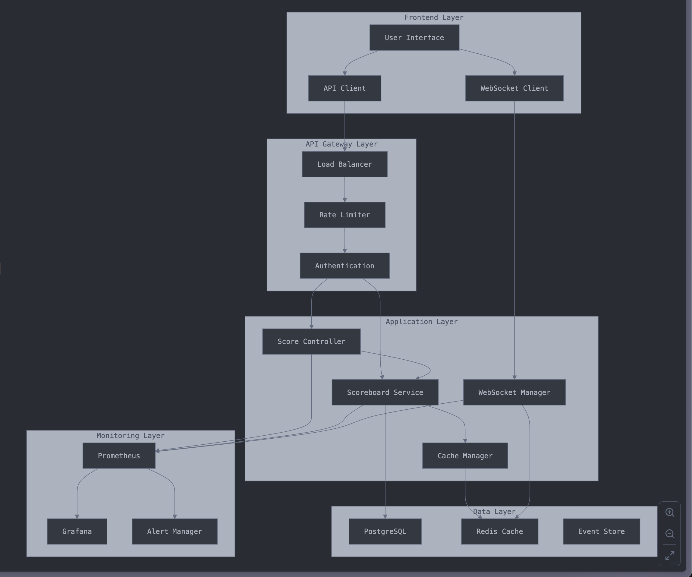

# Live Scoreboard API Service - Execution Flow Diagrams

## 🔄 Score Update Flow Sequence Diagram

## 📊 Scoreboard Retrieval Flow

## 🔐 Authentication & Security Flow

## 🌐 WebSocket Communication Flow

## 🔄 Cache Management Flow

## 📊 Real-time Data Flow Architecture

---

## 📝 Diagram Notes

### Key Design Principles

1. **Separation of Concerns**: Each component has a single responsibility
2. **Fail-Fast**: Early validation and error handling
3. **Caching Strategy**: Multi-layer caching for performance
4. **Security First**: Authentication and authorization at every step
5. **Real-time Updates**: WebSocket for live scoreboard updates

### Performance Considerations

- **Cache Hit Ratio**: Target > 90% for scoreboard queries
- **Response Time**: < 100ms for scoreboard, < 200ms for updates
- **Concurrency**: Handle 1000+ concurrent score updates
- **Scalability**: Horizontal scaling via load balancers

### Security Measures

- **JWT Validation**: Secure token-based authentication
- **Rate Limiting**: Prevent abuse and DoS attacks
- **Input Validation**: Sanitize all incoming data
- **Audit Logging**: Track all score modifications
- **IP Filtering**: Block suspicious IP addresses
